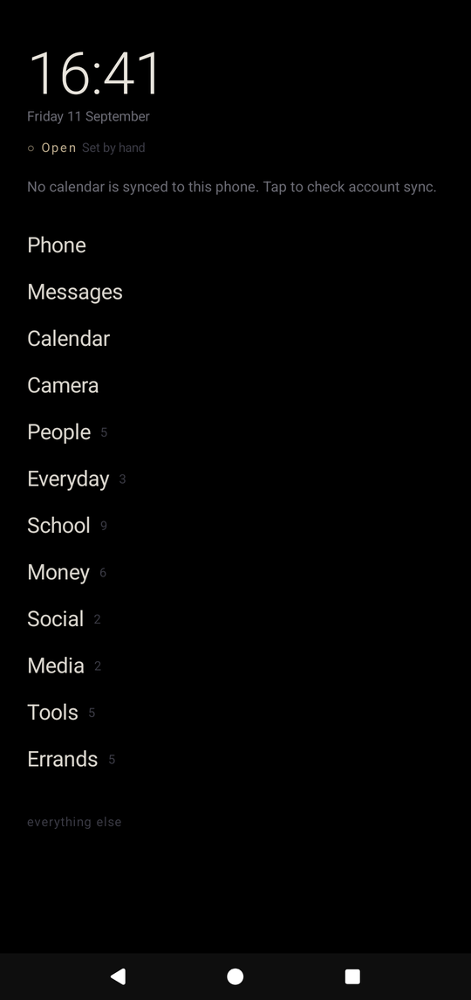
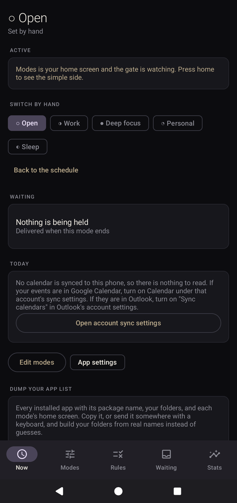
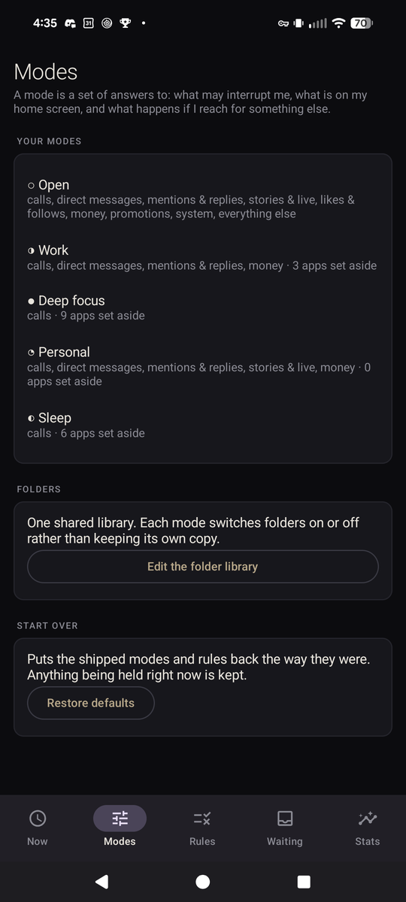
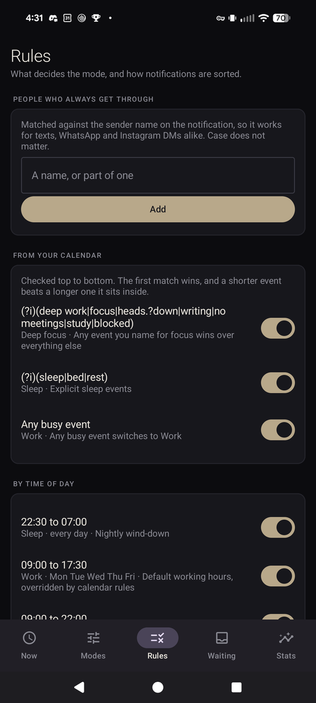
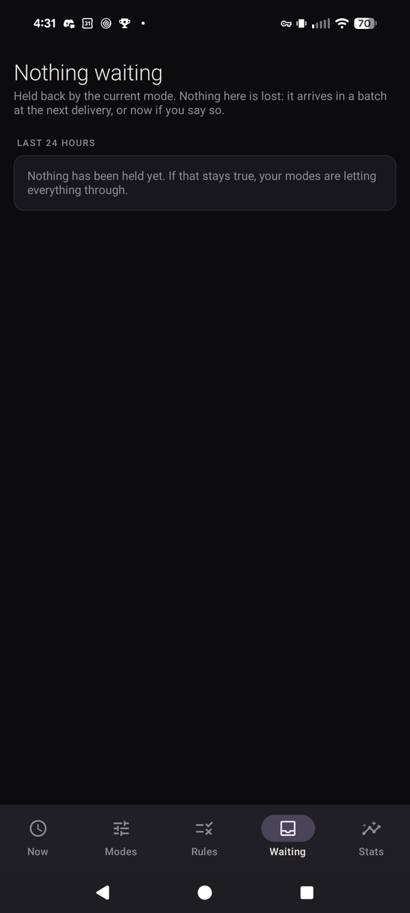

# Modes

An Android app that makes one phone behave like several, and switches between
them on a schedule you already keep: your calendar.

Built for a Pixel, sideloaded, no root, no Play Store.

## What it actually does

**Nothing is silenced. Things are batched.** The one rule the whole app is built
around: you should never miss a call, a text, or a DM from someone who matters,
and you should never be pulled out of your afternoon by "12 people liked your
post". So the app sorts notifications by *what they are*, not by which app sent
them, lets the important ones straight through, and holds the rest until a time
you picked.

Two faces. **Editing** happens in the app, with icons, pickers and switches,
because choosing between forty apps is faster with pictures. **Living with it**
happens on the home screen, which is black, has no icons, and shows the day
first: what is happening now, what is next, then the mode's apps as folders.
The simplicity starts the moment you activate it, not before.

Four moving parts:

| Part | What it is | Optional? |
|---|---|---|
| Mode engine | Picks the current mode from your calendar and a time schedule | No |
| Notification gate | A `NotificationListenerService` that holds the noise and batches it | No |
| Home screen | Black. Now and next from your calendar, then the mode's apps in folders | No, once activated |
| App guard | An `AccessibilityService` that stops you opening what the mode is not for | Yes |
| Stats | Counts of what was held, stopped and opened, plus screen time from the system | - |

The last two are genuinely optional. Skip them and everything else still works.

## Five modes ship with it

| Mode | Gets through | Home screen | Guard | Delivery |
|---|---|---|---|---|
| Open | everything | **icons**, every folder | off | immediately |
| Work | calls, DMs, mentions, money | text: Work, Everyday, Money | allowlist, pause | 12:30 and 17:00 |
| School | calls, DMs, money | text: School, Tools, People | allowlist, pause | when the timetable lets up |
| Deep focus | calls and fraud alerts only | text: Tools, Money, greyscale | allowlist, sent home | when the mode ends |
| Personal | calls, DMs, mentions, stories, money | **icons**, Everyday, Social | blocklist, pause | every 90 minutes |
| Sleep | calls from starred contacts, fraud alerts | text: clock, phone, messages | allowlist, pause | 07:30 |

### Two home screens, on purpose

Open and Personal draw **icons in a grid**, folders as tiles. Work, School and
Sleep draw **names only**. Icons are quicker to hit and nicer to look at, which
is exactly the argument for them in a mode where browsing is fine and exactly
the argument against them in one where you are meant to be doing something
else. The text list is duller by design. Both read the same folders; only the
invitation differs. Set per mode under Modes > a mode > Home screen.

Edit any of them in the app. Nothing here is hardcoded.

## Folders are shared, switches are per mode

There is one folder library. "Social" is defined once and means the same three
apps everywhere. What changes between modes is only which folders are **switched
on**:

| Folder | Open | Work | Deep focus | Personal | Sleep |
|---|---|---|---|---|---|
| People | on | on | **off** | on | **off** |
| Everyday | on | on | **off** | on | - |
| School | on | on | **off** | **off** | - |
| Money | on | on | on | on | on |
| Social | on | **off** | **off** | on | **off** |
| Media | on | **off** | **off** | on | **off** |
| Tools | on | on | on | on | - |
| Errands | on | **off** | **off** | on | **off** |

Each folder ships naming every app this build knows about for that purpose,
and **is pruned to what you actually have the first time it is seeded**. So the
Money folder arrives listing your banks rather than twenty you have never heard
of, without anyone having to curate it by hand. `Folders > Tidy up` does the
same again later, after you install or remove things.

Edit contents, rename, reorder the folders, and reorder the apps inside each
one under **Modes > Edit the folder library**. The first app in a folder is the
one under your thumb when it opens, so that order is worth setting. Flip switches per
mode under **Modes > (a mode) > Arrange home screen**, or long-press any folder
on the home screen to land straight on its switches.

This matters more than tidiness. Under an allowlist guard a folder switched off
is not hidden, it is forbidden: turning "Social" off for Work is the same act as
saying Work may not open Instagram.

## The home screen is the allowlist

Each mode's home screen is a list of rows. A row is either a single app or a
folder from the library:

```
9:41
Thursday 11 September
◑ Work   Sprint planning

alarm   6:30 tomorrow
drive   Home · Work · School

● NOW
Sprint planning
until 11:00

 ● all day  Quarter ends
 ● 14:00    Design review

TOMORROW
 ● 10:00    Standup
 ● 13:00    Work            <- bold, because it matters

Phone
Messages
Calendar
Work        5
Everyday    3
Money       9

everything else
```

Each dot carries its calendar's own colour, the one you chose in Google
Calendar, so school, work and family are told apart without reading a word.

Two events starting at the same minute have to be printed in some order, and
left to the provider that order is arbitrary. Two settings decide it:

1. **A marked title wins**, using the same pattern that draws it bold. A shift
   called "Work" outranks anything else at that minute.
2. **Then the calendar order** from **Rules > Calendars on this phone**, where
   "to top" promotes one in a single tap. Put your timetable first and a 10:00
   lecture sits above a 10:00 tailgate.

Time still comes first, always. Nothing marked important ever hides under
something later in the day: the agenda is a day, not a ranking.

One tap on a place under **drive** starts directions to it. Google Maps keeps
its own Home and Work and offers no way to read them, so these are yours, typed
once under Rules.

An app *could* instead drive the Maps interface through an accessibility
service and press its buttons for you. That would mean granting a service the
right to read everything on every screen, forever, to save typing an address
once, and it would break on the next Maps redesign. The navigation intent does
the same job and cannot.

The next alarm is the system's own, the same one in the status bar, so it
includes timers other apps set. It turns gold within the hour, and tapping
opens whichever app owns it.

Tap a folder to expand it in place, long-press to edit which folders this mode
uses. Tomorrow is shown in a quieter weight below today, so the evening
question of "what am I walking into" is answered without unlocking anything.
All-day entries appear in the lists but are never promoted to the headline: a
deadline spanning the whole day is worth seeing and is not what you are doing
right now.

Events whose title matches a pattern of yours are drawn bold with a marked
dot. It defaults to anything containing "work", which is the shift you cannot
afford to skim past; change it under Rules > Events worth noticing.

Days are split using the calendar provider's own day numbers rather than
timestamps. An all-day event is stored as UTC midnight to UTC midnight, so
west of Greenwich an all-day Sunday event begins at 20:00 on Saturday and lands
under the wrong heading if you bucket by milliseconds. Apps you reach for constantly sit at the top
level, because a folder you open twenty times a day is just friction.

**When a mode's guard is set to allowlist, this screen is also its permission
list.** Anything not reachable from it gets stopped. That is what answers the
awkward case: an app you installed last week, or one a link opened, was never
put in a folder, so the mode will not let you sit in it. You do not have to
predict what will distract you, which is the thing a blocklist gets wrong.

Each mode picks its own scope, under "If you reach for one anyway":

- **Only apps I set aside** (blocklist) - loose. Anything new is allowed.
- **Anything not on my home screen** (allowlist) - strict. Anything new is not.

**Rules > Apps that are always allowed** adds your own standing exceptions,
above every mode, for the things that are neither distraction nor emergency and
still need to run whenever they like.

These are never stopped under any setting, so you cannot lock yourself out:
Phone, Messages, Contacts, Clock, Settings, the authenticator, the system UI,
the permission controller, the installer, the keyboard, and every money app.

## Money

Banking, cards and payments are treated as their own class, `FINANCE`:

- **Their notifications are allowed in Open, Work and Personal.**
- **Fraud alerts break through every mode, including Sleep and Deep focus.**
  So do one-time passcodes. Anything matching fraud, suspicious activity, a
  declined card, a locked account or an overdraft is marked `alwaysThrough` and
  ignores the mode entirely.
- **Ordinary transactions are ordinary.** "You paid $4.50" is held in Deep focus
  and Sleep and arrives with the batch.
- **Money apps are never guarded,** even in Deep focus, and even if you put one
  on a blocklist by accident. A fraud alert you cannot act on is worse than the
  distraction.
- **Allowing an app does not let it advertise at you.** A bank on the allow list
  still gets its "introducing our new credit card" held, because the promo rules
  are checked first.

The shipped list covers the common US banking, payment, brokerage and campus
card apps. Anything it misses is one line in `Pkg.FINANCE`, or a rule you add
in the app. The next section is how to find out what you actually have.

## Dumping your app list

Package names are the one thing you cannot guess from a desktop, and the shipped
folders are educated guesses about a phone nobody has seen.

Note that "installed" and "has an icon" are different questions. Archived apps
stay installed, keep their name, and vanish from the launcher query, so the dump
marks them `no icon` rather than pretending they are gone.

**From the phone**, with no computer involved: open the app, go to **Now > Dump
your app list**, and tap **Copy** or **Send**. You get every installed app with
its package name, the folder library, and every mode's home screen with each row
marked on or off. Copy puts it on the clipboard to paste anywhere; Send opens
the share sheet with the report as a text file.

**From a computer**, over adb:

```bash
./tools/pull-apps.sh            # every app, name and package, as a table
./tools/pull-apps.sh --all      # the full report, same as the in-app dump
./tools/pull-apps.sh --kotlin   # constants to paste into Defaults.kt
./tools/pull-apps.sh --json     # machine readable
```

Both routes use the same builder, `AppListExport`. With the app not yet
installed the script falls back to `pm list packages -3`, which gives packages
only.

## How the mode gets chosen

Highest priority wins:

1. **A manual switch** you made in the app, until you clear it
2. **A calendar event** matching a calendar rule. A shorter event beats a longer
   one it sits inside, so a 30 minute block named "deep work" wins over the
   4 hour "Offsite" it lives in
3. **A time of day rule**, e.g. 22:30 to 07:00 is Sleep
4. **The default mode**

Out of the box your calendar decides everything except bedtime:

| An event saying | puts you in |
|---|---|
| deep work, heads down, writing, no meetings | Deep focus |
| sleep, bed | Sleep |
| school, class, lecture, lab, exam, quiz, homework | School |
| work, shift, on call, clock in | Work |
| anything else, or nothing at all | Open |

**There is no catch-all.** An unnamed meeting is not a reason to reshape your
phone, and there is no working-hours clock rule either: whether you are at work
is a question the calendar already answers, and guessing it from the time of
day puts you in Work on a Tuesday you took off. The only clock rule left is the
nightly wind-down at 22:30.

Declined and cancelled events are ignored, because an invitation you said no to
should not reshape your phone.

Transitions are driven by three overlapping mechanisms, because none is reliable
alone: an exact alarm at the next boundary, a 15 minute periodic worker as a
safety net, and a broadcast when the calendar provider changes underneath you.

## How the notification gate works

Every notification is sorted into one class:

`CALL`, `DIRECT`, `MENTION`, `STORY`, `SOCIAL`, `FINANCE`, `PROMO`, `SYSTEM`,
`OTHER`

A mode names the classes that ring through. Everything else is held.

Holding is done by **snoozing**, not cancelling, so the original comes back with
its real icon, its real tap target and its real reply box. At the delivery
window the app also posts a stand-in copy of each held item carrying the
original's tap target and actions, so the batch lands the moment the window
opens rather than whenever the system's snooze timer expires. When the genuine
notification later comes out of snooze, the gate recognises it and takes the
stand-in down. You get one batch, at a time you chose, with nothing lost.

Some things are never touched at all: alarms, calls, navigation, media
transports, and anything ongoing. A rule can also be marked **always through**,
which overrides the mode completely. That is reserved for the short list of
things that are never noise: incoming calls, one-time passcodes, and fraud
alerts.

### Instagram, honestly

There is no Instagram API for DMs or stories, and there will not be one. Every
third party "Instagram companion" either scrapes (bannable) or reads
notifications. This reads notifications.

What that means in practice:

- **DMs are detected reliably.** Not by wording, which is unpredictable, but by
  structure: an Instagram notification carrying an inline reply box is a DM.
  That check lives in `Classifier.classify` and is the single most useful line
  in the app.
- **Stories work, with one setup step.** Instagram only notifies you about a
  story if you have notifications turned on for that person. Turn them on for
  the handful you care about (their profile, the bell icon), and the `STORY`
  class handles the rest. Personal mode lets stories through, Work and Focus
  hold them.
- **Likes, follows, suggestions and "see what X has been up to" are matched by
  text** and classified as `SOCIAL` or `PROMO`. The patterns are in
  `Defaults.notifRules()` and editable in the app under Rules. Instagram changes
  its wording occasionally, so if something starts leaking through, add a rule
  rather than rebuilding.

### People who always get through

Add names under Rules. They are matched against the sender name on the
notification, so one entry covers that person across texts, WhatsApp and
Instagram DMs at once. A match overrides the mode entirely.

### Calendars that are on but empty

**Rules > Calendars on this phone** lists every calendar the provider knows
about with a switch and a count of its events. Two columns govern this and only
one is obvious: `VISIBLE` decides whether calendar apps draw it, `SYNC_EVENTS`
decides whether its events are on the device at all. The switch sets both,
because setting only the first leaves you with a calendar that is meant to be
shown and has nothing in it.

This exists because current Google Calendar builds no longer expose the
setting, so a shared or subscribed calendar can be ticked there and still be
entirely absent from the phone. School calendars fed from Canvas are the common
casualty.

### "Nothing on the calendar" when there plainly is

The app reads the phone's own calendar store, the one Android keeps for every
calendar app to share. It cannot see events that live only inside an app. So:

- **Google Calendar:** Settings > Passwords & accounts > the account > Account
  sync > **Calendar** must be on. Nine Google accounts with that switch off is
  a store with nothing in it.
- **Outlook:** Outlook > Settings > the account > **Sync calendars**. Off by
  default, and school and work accounts almost always live here.
- **Private space:** an app installed in the private space keeps its data in a
  separate user that Modes cannot read.

The dump (Now > Dump your app list) has a Calendar section that shows exactly
what the app can read: whether permission is granted, every calendar in the
phone's store with its account type and sync flags, and the events in the next
24 hours. Zero calendars there with Google Calendar happily showing events is
the signature of the account-level Calendar sync switch being off: Google's app
syncs through its own pipeline regardless, but only that switch fills the
system store that everything else reads.

The home screen and the Now tab say which of these it is: "no calendar is
synced to this phone" is a different problem from "nothing today", and it is
labelled as such, with a tap through to account sync settings.

## Activating it

Editing is in the app. The simple part only starts when Modes becomes the home
screen, so the Now screen leads with one button: **Make Modes my home screen**.
It opens Android's own "set default home" dialog, which is the correct way to
do this, rather than sending you off to find a setting. Your old launcher is
not removed, it is just no longer what the home button opens, and the same
dialog puts it back.

Until that and the other required switches are on, the Now screen says so and
nothing is considered active.

## The lock screen

**No app can replace Android's lock screen.** That is a platform restriction
with no way around it, and anything claiming otherwise is a launcher pretending.

What is possible is owning what appears there. The current mode is posted as a
sticky, public notification carrying the next thing on your calendar, so on a
lock screen the gate has otherwise emptied it is the one line left worth
reading. Deep focus and Sleep also dim the wallpaper and drop the always-on
display through `ZenDeviceEffects`, which is as close to a different lock
screen as Android permits.

## Leaving on time

Off by default; turn it on under Rules. For any calendar event with a location
it works backwards:

```
event starts            09:00
- be there early (10m)  08:50   parked, walked in, sat down
- the drive      (25m)  08:25
= leave at              08:25
- get ready       (5m)  08:20   the nudge
```

The nudge carries a **Navigate** button that opens directions. It offers; it
never starts navigation by itself. Deciding to take over the screen of someone
who may already be driving is not a convenience worth having, and that is a
deliberate limit rather than an unfinished one.

The drive time is a flat number you set, not live traffic. Live traffic needs a
routing API key and a billing account, so it is left out rather than
half-implemented. `Commute.nextPlan` takes a `travelMinutesFor` function
specifically so a real provider can be dropped in without touching anything
else.

**Driving detection is not built.** It is possible through Play Services
Activity Recognition, at the cost of a Play Services dependency, the
`ACTIVITY_RECOGNITION` permission and steady battery use. Worth doing on
purpose, not by accident.

## Stats

The Stats tab is numbers, not charts. Today: notifications held versus let
through, and which apps and classes made up the noise; where the day went, in
time per mode; how many times a mode stopped you and how many times you went
in anyway; what you opened from the home screen. Then the same for each of the
last seven days.

With usage access granted, it also shows per-app screen time from the system's
own counters, which are more honest than anything this app could measure.

Events are kept for thirty days and then dropped. This is for noticing
patterns, not for surveillance, and "how many times did I put it down" turned
out to be the one number that matters.

## Screenshots

Taken on a Pixel 8a over adb, from the app as it actually runs. Screens that
would show a real bank list, app inventory or screen time are left out of the
repo on purpose; take your own with the script below.

<p align="center">
  
  
  
</p>
<p align="center">
  
  
</p>

Left to right: the home screen (this is the whole point), the Now tab, the mode
list, the rules, and the waiting room.

### Taking your own

```bash
./tools/screenshots.sh          # walks through every screen
./tools/screenshots.sh --list   # what it can capture
./tools/screenshots.sh home now # just those
```

It tells you what to open, you navigate, you press Enter. Driving Compose
through `adb` taps is possible and breaks every time a layout moves, so it asks
instead. Output lands in `docs/screenshots/`, with a ready-made markdown block
to paste back into this file.

### Emulator

```bash
./tools/emulator.sh --check     # will this machine run one?
./tools/emulator.sh --install   # emulator and system image, about 2G
./tools/emulator.sh --create    # make the AVD
./tools/emulator.sh --start     # boot it headless
```

`--check` runs first and refuses the rest if the machine cannot do it properly.
An emulator without hardware virtualisation does technically run, at a speed
that makes it useless, so the script says no rather than letting you find out
over the following hour. It needs `/dev/kvm` and about 6G free.

## Building it

Needs a JDK 17 or newer and an Android SDK with platform 35.

```bash
./tools/bump-version.sh            # 0.1.4 -> 0.1.5, and the build number
./gradlew :app:assembleRelease
# app/build/outputs/apk/release/Modes-v0.1.5-release.apk
```

The version lives in `version.properties` at the repo root and the APK is named
after it, so two builds are never confused on the phone. Bump it before every
install: Android refuses to upgrade a package whose `versionCode` has not
increased. `--minor` and `--major` are there when a change deserves it.

If `local.properties` does not point at your SDK, fix that first. Unit tests:

```bash
./gradlew :app:testDebugUnitTest
```

## Installing it

```bash
./tools/install.sh          # installs, and explains any failure in words
./tools/install.sh --clean  # uninstall first, when the signature changed
./tools/install.sh --check  # report what is on the phone, change nothing
```

Or copy `Modes-vX.Y.Z-release.apk` to the phone and tap it.

**Install the release build, not the debug one.** A debug APK carries
`android:debuggable="true"`, and current Android and Play Protect routinely
refuse to sideload those. It looks like a corrupt download and is not. Release
builds are signed with the key in `keystore.properties`, which is why they
install and why upgrades keep working.

### When it will not install

The phone says "App not installed" for several unrelated reasons and never says
which. `./tools/install.sh` prints the real error and what to do about it. The
usual suspects:

| What Android says | What it means |
|---|---|
| `INSTALL_FAILED_UPDATE_INCOMPATIBLE` | A copy signed with a different key is already there. Uninstall it: `./tools/install.sh --clean`. Expected exactly once, moving off the debug key. |
| Play Protect warning, or `USER_RESTRICTED` | Play Protect blocking an unknown app. Tap "More details" then "Install anyway", or turn off scanning in Play Store > Play Protect while you install. |
| `INSTALL_FAILED_VERSION_DOWNGRADE` | The phone has a newer build. `./tools/bump-version.sh` and rebuild. |
| `INSTALL_PARSE_FAILED_*` | Truncated transfer. Check the file against the `.sha256` next to it. |

### The signing key

Release builds are signed with a key at `~/.modes-signing/modes.jks`, with the
passwords in `keystore.properties` at the repo root. Both are gitignored.

**Back them up.** Android will only accept an upgrade signed with the same key,
so losing the keystore means every future version has to be installed over an
uninstall, taking your settings with it. A fresh clone without these files still
builds; release falls back to the debug key and Gradle warns that the result
probably will not install.

## First run, in this order

The app has a checklist on the Now screen that shows what is still missing, but
two of these steps are non-obvious on a sideloaded build, so they are written
out here.

1. **Open the app once.** Grant calendar, contacts and notification permissions
   when prompted.

2. **Allow restricted settings.** This is the one that will waste your evening
   if you do not know about it. Android 13 and newer block sideloaded apps from
   the notification-access and accessibility switches until you explicitly
   unlock them:

   > Settings > Apps > Modes > three dots, top right > **Allow restricted
   > settings**

   The switches in the next two steps will be greyed out until you do this.

3. **Notification access.** Settings > Notifications > Device and app
   notifications > Modes. Nothing works without this.

4. **Do Not Disturb access.** Grant it from the checklist. Each mode then
   registers its own rule, which is why your modes show up in Android's own
   Modes/Do Not Disturb screen and survive reboots.

5. **Exact alarms**, so switches land on the minute rather than whenever the
   system gets round to it.

6. **Optional: app guard.** Settings > Accessibility > Modes app guard. It reads
   only the package name of the foreground window. `canRetrieveWindowContent` is
   `false` in the service config, so it cannot see anything on your screen.

7. **Optional: the minimal home screen.** Settings > Apps > Default apps > Home
   app > Modes Home. Press home to see it. To go back, set your old launcher
   again from the same screen.

8. **Turn on Instagram notifications for the few people whose stories you
   actually want.** See above.

9. **Check your folders against reality.** Run `./tools/pull-apps.sh`, then edit
   each mode's home screen in the app. The shipped folders reference apps you
   may not have, and under allowlist an app in no folder is one you cannot open.

## Greyscale

Deep focus and Sleep turn the screen greyscale and dim the wallpaper. Colour is
most of what makes a phone hard to put down, so this does more work than it
looks like it should.

This uses `ZenDeviceEffects`, which needs **Android 15 or newer**. On anything
older the modes still work, just without the visual changes. Device effects on
app-owned rules can also be filtered by the system, so the call is wrapped and
degrades quietly rather than crashing.

## Where things live

```
core/model/Models.kt      every entity and enum, start here
core/Defaults.kt          the five modes, the folder library, schedule,
                          Instagram and money rules
core/model/Models.kt      resolveHomeRows joins modes to the folder library
core/repo/ModeRepository  the cached PolicySnapshot the gate reads
schedule/ScheduleResolver which mode should be running, and when that changes
schedule/ModeScheduler    alarms, the periodic worker, digest windows
apply/ZenController       one AutomaticZenRule per mode
apply/ModeApplier         turns a decision into actual phone behaviour
notify/Classifier         what a notification is, and whether it gets through
notify/NotificationGate   the listener service
notify/DigestPublisher    batching and release
schedule/AgendaOrder      the order a day is read in
commute/Commute           when to leave, as arithmetic
commute/Destinations      places worth one tap
guard/GuardPolicy         whether an app may be opened, pure and well tested
guard/AppGuardService     the foreground app watcher
launcher/LauncherActivity the minimal home screen, agenda and folders
tools/AppListExport       builds the dump, shared by the app and the script
tools/ShareDump           clipboard and share sheet
tools/ExportReceiver      lets adb ask for a dump without opening the app
ui/screens/FoldersScreen  the shared folder library
ui/screens/StatsScreen    what the phone did today, in numbers
core/repo/Stats           fire-and-forget event logging
ui/                       Compose settings, four tabs
```

The gate has to decide on the main thread in microseconds, so it reads
`ModeRepository.snapshot`, an immutable object with pre-compiled regexes, rather
than touching the database. If you add anything the gate needs, add it there.

## Things to know before you rely on it

- **The gate cannot un-snooze.** Once a notification is snoozed there is no API
  to bring it back early, which is why "deliver now" posts stand-in copies
  instead. It is a workaround, and it is the reason for `ReleaseLedger`.
- **Holds are chunked to two hours.** Android will not hold a snoozed
  notification indefinitely, so long holds re-snooze each time the item
  reappears. Self-correcting, but it means a held item passes through the gate
  several times overnight.
- **Stand-in copies come from "Modes", not the original app.** Tapping still
  opens the right thread, and reply boxes still work, because the original
  `PendingIntent` and actions are reused. Those are kept in memory, so if the
  listener service is restarted while something is held, that item degrades to
  plain text.
- **Allowlist mode is strict on purpose,** and the escape hatches are what make
  it safe. Read `GuardPolicy.NEVER_GUARD` and `Pkg.ESSENTIAL` before changing
  anything there. `GuardPolicyTest` asserts every one of them stays reachable.
- **The guard reacts to a window change,** so it stops you a moment after the
  app draws rather than before. It is a pause, not a lock, and a determined
  thumb can still get through by turning the service off in Settings. That is
  deliberate: a tool you cannot escape is one you will uninstall.
- **Database migrations are destructive** (`fallbackToDestructiveMigration`),
  and the schema is at version 6. Upgrading from an earlier build resets your
  modes and folders to the defaults, which is how retuned folders arrive.
- **`QUERY_ALL_PACKAGES` is declared.** A launcher has to be able to list what
  is installed, and the `<queries>` element alone misses archived apps. This is
  a restricted permission on Play and irrelevant to a sideloaded build.
- **Only `arm64-v8a` is packaged.** That is what a Pixel is; shipping four
  architectures tripled the size for nothing. Add them back in `abiFilters` if
  the app ever needs to run on something else.
- **R8 is off for release builds.** The system instantiates
  `NotificationGate` and `AppGuardService` by name, and debugging a stripped
  service on a phone is miserable. The APK is bigger than it needs to be and
  that is the trade.
- **`targetSdk` is 35 while the phone runs Android 17.** Everything works, but
  the app is getting compatibility behaviour rather than the current one. Worth
  raising when there is a reason to. Fine while iterating. Change it before you
  have settings worth keeping.

## Tests

`app/src/test/` covers the three pieces most likely to be subtly wrong and
hardest to debug on a phone:

- **`ScheduleTest`** - schedule windows that cross midnight, and digest maths.
- **`GuardPolicyTest`** - which apps a mode will and will not open, including an
  assertion that every essential and every money app stays reachable in the
  strictest mode, and that a folder switched off really is unreachable rather
  than merely hidden. If you change the guard or the folder model, this is the
  file that stops you locking yourself out.

```bash
./gradlew :app:testDebugUnitTest
```

- **`DefaultsTest`** - the shipped modes checked against a real phone's app
  inventory. It asserts every folder has something on the device, that every
  mode can still reach a dialer, a way to text and a bank, and that no
  allowlist mode would stop you opening an essential. This is the file that
  catches a default that reads fine but leaves you stranded at 11pm.

```bash
./gradlew :app:testDebugUnitTest
```

- **`StatsTest`** - reconstructing time-per-mode from the change log.
- **`AgendaDayTest`** - which day an event belongs to, all-day events included.
- **`CommuteTest`** - working backwards to the moment you have to leave.
- **`DuplicateRowsTest`** - repairing a home screen that seeded itself twice.
- **`DestinationsTest`** - storing places without mangling an address.
- **`AgendaOrderTest`** - which of two events at the same minute comes first.

105 tests, all passing.
